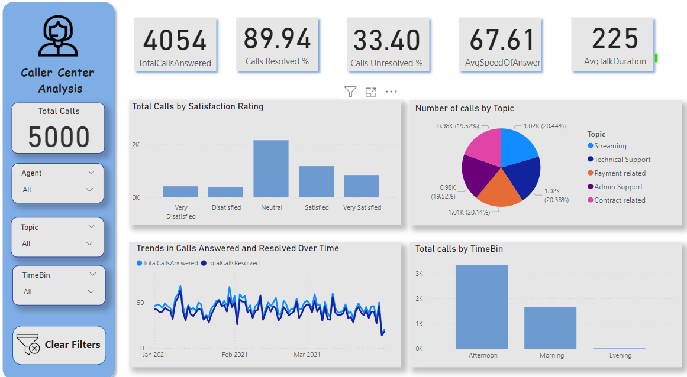

# 📞 **Caller Center Analysis Dashboard**

### 🚀 **Overview**
This project presents a **dynamic and interactive Power BI dashboard** designed to analyze and visualize call center performance. It provides a comprehensive view of key metrics, trends, and actionable insights, helping stakeholders make data-driven decisions. Using slicers, users can drill down into specific agents, topics, and time bins for deeper analysis.

---

## **📊 Dashboard Features**

### **Key Metrics (KPIs):**
- **Total Calls Answered**: **4054**
- **Calls Resolved (%)**: **89.94%**
- **Calls Unresolved (%)**: **33.40%**
- **Average Speed of Answer**: **67.61 seconds**
- **Average Talk Duration**: **225 seconds**

### **Interactive Visualizations:**
1. **Satisfaction Ratings Analysis**:
   - Displays the distribution of calls rated as Very Dissatisfied to Very Satisfied.
2. **Call Distribution by Topic**:
   - Highlights the proportion of calls for key topics (e.g., Payment-Related, Technical Support).
3. **Call Handling Trends**:
   - Line chart showing patterns in call handling efficiency over time.
4. **Calls by Time Bin**:
   - Bar chart showing call distribution across Morning, Afternoon, and Evening for resource optimization.

### **Filters and Slicers:**
- Use dynamic slicers to filter data by:
  - **Agent**
  - **Call Topic**
  - **Time Bin**
- A "Clear Filters" button allows for quick resets to explore fresh insights.

---

## **🔍 Target Questions Addressed**
### The dashboard provides answers to the following complex questions:
1. **How effectively is the call center resolving customer issues over time?**
   - By analyzing **Trends in Calls Answered and Resolved**, users can track resolution rates and identify periods of inefficiency.

2. **What proportion of calls remain unresolved, and how does this vary by topic, time, or agent?**
   - The **Calls Unresolved (%)** KPI combined with slicers allows users to identify patterns in unresolved calls across multiple dimensions.

3. **Which topics drive the highest call volumes, and how do resolution rates compare across these topics?**
   - The **Call Distribution by Topic** pie chart highlights call drivers and allows deeper exploration using slicers.

4. **What patterns can be observed in call handling performance based on time of day?**
   - The **Calls by Time Bin** visualization highlights peak call hours, enabling better staffing decisions.

5. **How does customer satisfaction correlate with call resolution, and what factors drive dissatisfaction?**
   - The **Satisfaction Ratings Bar Chart** provides insights into satisfaction levels, with slicers to drill down into dissatisfied calls by agent or topic.

6. **Which agents handle the highest call volumes, and how does their performance affect resolution rates?**
   - By filtering using the **Agent slicer**, users can pinpoint high-performing agents and identify areas for training or improvement.

---

## **📈 Results and Insights**
- **High Call Resolution Efficiency**:
  - **89.94%** of answered calls are resolved, indicating strong operational performance.
- **Opportunity for Improvement**:
  - **33.40%** of calls remain unresolved, suggesting areas for improvement in agent training or process optimization.
- **Satisfaction Levels**:
  - Most customers rate their experience as **Neutral or Satisfied**, but dissatisfaction remains prevalent for **Technical Support** queries.
- **Time-Based Trends**:
  - Peak call volumes occur in the **Afternoon**, requiring optimized staffing during this period.
- **Key Topics**:
  - Calls related to **Contract Issues** and **Payment** contribute the largest volumes, requiring focused monitoring.

---

## **🛠️ How to Use the Dashboard**
### **Explore Key Metrics**:
- KPIs at the top provide an overview of performance.
- Use slicers to focus on specific agents, topics, or time bins.

### **Drill Down for Deeper Insights**:
- Filter dissatisfaction ratings to identify problem areas by topic or agent.
- Analyze unresolved call percentages by time or topic.

### **Plan Resource Allocation**:
- Use time bin distribution to identify peak periods.
- Focus on high-volume topics for operational planning and resource optimization.

---

## **🌟 Future Enhancements**
1. **Predictive Analytics**:
   - Implement machine learning models to forecast call volumes based on historical data.
2. **Agent-Level Performance**:
   - Add visuals to track individual agent performance, such as resolution rates and satisfaction scores.
3. **Root Cause Analysis**:
   - Integrate drill-through pages for deeper analysis of unresolved calls and dissatisfied customers.

---

